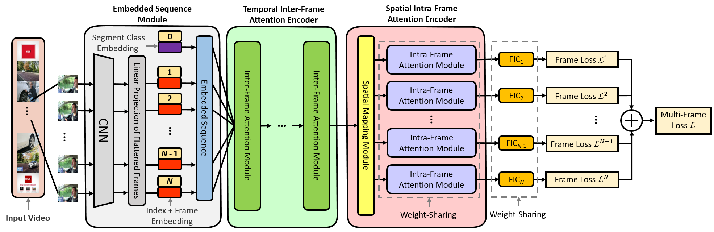

# STVT (Spatiotemporal Vision Transformer)

## Video Summarization With Spatiotemporal Vision Transformer


The paper is published in IEEE Transactions on Image Processing, 2023.

https://ieeexplore.ieee.org/document/10124837

Video summarization aims to generate a compact summary of the original video for efficient video browsing. We propose a novel transformer-based method named spatiotemporal vision transformer (STVT) for video summarization. The STVT is composed of three dominant components including the embedded 15 sequence module, temporal inter-frame attention (TIA) encoder, and spatial intra-frame attention (SIA) encoder. The embedded sequence module generates the embedded sequence by fusing the frame embedding, index embedding and segment class embedding to represent the frames. The temporal inter-frame correlations among non-adjacent frames are learned by the TIA encoder with the multi-head self-attention scheme. Then, the spatial intra-frame attention of each frame is learned by the SIA encoder. Finally, a multi-frame loss is computed to drive the learning of the network in an end-to-end trainable manner. By simultaneously using both inter-frame and intra-frame information, our method outperforms state-of-the-art methods in both of the SumMe and TVSum datasets. 

## Usage

First, download the dataset file  

Prepared .h5 file   
SumMe in ECCV'14 [29]  

https://drive.google.com/file/d/192n-CPd_cQ9ac6hRpq1rbYefslGGl9Wf/view?usp=share_link  

TVSum in CVPR'15 [30] 

https://drive.google.com/file/d/1ZmMSgyNt-np1Se3ggrShUhPS-uzxRv-n/view?usp=share_link  

Please put them into "./STVT/datasets/datasets"  
## Instructions for Code:

```
cd STVT
train.py --roundtimes save_name --dataset TVSum or SumMe
```
The eval is included in training.py   

## Requirements
The most important packages:
```
torch                       1.7.1+cu101
torchaudio                  0.7.2
torchsummary                1.5.1
torchvision                 0.8.2+cu101
torchviz                    0.0.2
```
The other details
```
absl-py                     1.0.0
anyio                       3.5.0
apex                        0.1
argon2-cffi                 21.3.0
argon2-cffi-bindings        21.2.0
attrs                       22.1.0
Babel                       2.12.1
backcall                    0.2.0
beautifulsoup4              4.11.1
bleach                      4.1.0
brotlipy                    0.7.0
cached-property             1.5.2
certifi                     2022.12.7
cffi                        1.15.1
charset-normalizer          2.0.4
click                       8.1.2
colorama                    0.4.6
contextlib2                 21.6.0
cryptography                38.0.4
cycler                      0.10.0
debugpy                     1.5.1
decorator                   5.1.1
defusedxml                  0.7.1
dukpy                       0.2.3
einops                      0.3.2
entrypoints                 0.4
fastjsonschema              2.16.2
Flask                       2.2.3
Flask-Moment                1.0.5
Flask-SQLAlchemy            3.0.3
Flask-WTF                   1.1.1
flit-core                   3.6.0
future                      0.18.2
graphviz                    0.16
greenlet                    2.0.2
grpcio                      1.42.0
h5py                        3.6.0
idna                        3.4
importlib-metadata          4.11.3
importlib-resources         5.2.0
ipykernel                   6.15.2
ipython                     7.31.1
ipython-genutils            0.2.0
itsdangerous                2.1.2
javascripthon               0.11
jedi                        0.18.1
Jinja2                      3.0.0
joblib                      1.0.1
json5                       0.9.6
jsonschema                  4.16.0
jupyter-client              7.4.8
jupyter-core                4.11.1
jupyter-echarts-pypkg       0.1.2
jupyter-server              1.23.4
jupyterlab                  3.5.3
jupyterlab-pygments         0.1.2
jupyterlab-server           2.16.5
kiwisolver                  1.3.1
lml                         0.0.2
lxml                        4.9.1
macropy3                    1.1.0b2
Markdown                    3.3.6
markupsafe                  2.1.1
matplotlib                  3.4.2
matplotlib-inline           0.1.6
mistune                     0.8.4
ml-collections              0.1.0
nbclassic                   0.4.8
nbclient                    0.5.13
nbconvert                   6.5.4
nbformat                    5.7.0
nest-asyncio                1.5.6
notebook                    6.5.2
notebook-shim               0.2.2
numpy                       1.20.3
opencv-python               4.5.5.62
packaging                   22.0
pandas                      1.3.4
pandocfilters               1.5.0
parso                       0.8.3
pickleshare                 0.7.5
Pillow                      8.2.0
pip                         21.1.1
pkgutil-resolve-name        1.3.10
prometheus-client           0.14.1
prompt-toolkit              3.0.36
protobuf                    3.19.1
psutil                      5.9.0
pycparser                   2.21
pyecharts                   0.5.11
pyecharts-javascripthon     0.0.6
pyecharts-jupyter-installer 0.0.3
Pygments                    2.11.2
pyOpenSSL                   22.0.0
pyparsing                   2.4.7
pyrsistent                  0.18.0
PySocks                     1.7.1
python-dateutil             2.8.2
pytz                        2022.7
pywin32                     305.1
pywinpty                    2.0.2
PyYAML                      6.0
pyzmq                       23.2.0
requests                    2.28.1
scikit-learn                0.24.2
scipy                       1.6.3
Send2Trash                  1.8.0
setuptools                  52.0.0.post20210125
six                         1.16.0
sniffio                     1.2.0
soupsieve                   2.3.2.post1
SQLAlchemy                  2.0.7
tensorboard                 1.15.0
tensorboardX                2.4.1
terminado                   0.17.1
thop                        0.0.31.post2005241907
threadpoolctl               2.1.0
timm                        0.5.4
tinycss2                    1.2.1
tomli                       2.0.1
tornado                     6.2
tqdm                        4.62.3
traitlets                   5.7.1
ttach                       0.0.3
typing-extensions           4.4.0
urllib3                     1.26.14
wcwidth                     0.2.5
webencodings                0.5.1
websocket-client            0.58.0
Werkzeug                    2.0.0
wheel                       0.36.2
win-inet-pton               1.1.0
wincertstore                0.2
WTForms                     3.0.1
zipp                        3.11.0
```

## Reference 

Please cite the following papers when you apply the code. 

[1] T.-C. Hsu, Y.-S. Liao and C.-R. Huang, "Video Summarization With Spatiotemporal Vision Transformer," IEEE Transactions on Image Processing, vol. 32, pp. 3013-3026, 2023, doi: 10.1109/TIP.2023.3275069.

[2] T.-C. Hsu, Y.-S. Liao and C.-R. Huang, "Video Summarization With Frame Index Vision Transformer," in Proc. International Conference on Machine Vision and Applications (MVA), Aichi, Japan, 2021, pp. 1-5, 2021, doi: 10.23919/MVA51890.2021.9511350.

